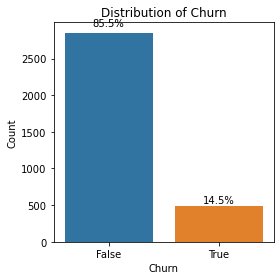
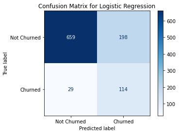
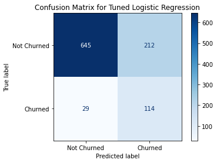
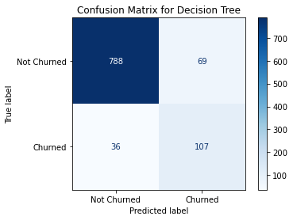
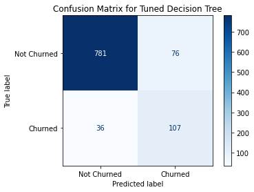

# Leveraging Machine Learning to Predict Customer Churn: A Case of SyriaTel Telecommunications Company

## Overview
This project leverages the [Churn in Telcom's dataset](https://www.kaggle.com/datasets/becksddf/churn-in-telecoms-dataset) to develop a binary classification model that will help SyriaTel determine whether a customer will abandon their services based on information provided in the dataset. The outcomes of this project can help SyriaTel identify what features cause customers to churn and develop strategies to maintain and grow their existing customer base.

## Business Understanding
Customer churn is a significant challenge in the telecommunications industry. High churn rates can signal underlying issues such as poor service quality or a lack of inadequate customer support. Addressing churn is crucial as acquiring new customers is more expensive than retaining existing ones. SyriaTel is currently grappling with challenges related to customer rentention. Understanding and predicting customer churn can help SyriaTel enhance its competitive edge and identify which customers are at risk of leaving, and thus enable the company to implement targeted retention strageies to reduce churn rates.

By applying data analytics and predictive modelling, SyriaTel can gain insights into the factors driving customer churn as well as applying some of the recommendations to improve profitability anf customer satisfaction.

### Business Objectives
The following are some of the objectives of this project:
1. Identify key factors leading to customer churn.
2. Develop predictive models to estimate the likelyhood of a customer churing based on the available data.
3. Provide recommendations and insights from the models to help SyriaTel develop customer retention strategies.

## Data Understanding
The [Churn in Telcom's dataset](https://www.kaggle.com/datasets/becksddf/churn-in-telecoms-dataset) contains 3333 entries with 21 columns with each column representing features that would lead to customer customer churn such as the total day and evening charge and the target column being whether a customer has churned or not. 

The dataset was cleaned initally in preparation for analysis. Afterwards Exploratory Data Analysis(EDA) was performed to gain insights into the distribution of the data as well as the interaction of features with the target value. The data was then cleaned again during data preparation, then scaled and split into the train and test set in preparation for modelling. During analysis we gained the following insight into the target variable:



The target variable shows that 85.5% of customers did not abandon SyriaTel's services whearas 14.5% who did. The target variable also showed evidence of a class imbalance. Based on the analysis done, features that contributed significantly to the churn target were retained.

## Modelling
Four classification models were developed to aid in our predictions. We employed the logistic regression model and decision tree model and performed iterations on both by performing hyperparameter tuning on the baseline models.

### Model 1: Logistic Regression Model
#### Baseline Model
The baseline model was built using default parameters. The model attained an overal accuracy of 77%. The model also attained a training accuracy of 76% and a test accuracy of 77%. Below is the confusion matrix:



#### Logistic Regression with Hyperparameter Tuning
The baseline model was improved further using GridSearch CV to get the optimal hyperparameters. The model's overall accuracy is 76% with a training accuracy of 77%, and a test accuracy of 76%. Below is the confusion matrix:



### Model 2: Decision Tree Model
#### Baseline Model
The model attained an overall accuracy of 90% with a training accuracy of 100% and a test accuracy of 90%. This model obviously exhibits problems with overfitting. Below is the confusion matrix:



#### Decision Tree Model with Hyperparameter Tuning
The baseline model was improved further using GridSearch CV to get the optimal hyperparameters. This model attained an overall accuracy of 89% with a training accuracy of 95% and a test accuracy of 89%. Below is the confusion matrix:



## Evaluation
Each model was evaluated by looking at the classification reports, ROC-AUC and lastly validated using k-fold cross-validation to ensure the model generalizes well to unseen data.

For the baseline models:
- The logistic regression model has a ROC-AUC score of 0.83 indicating a good ability to distinguish between classes. The mean cross validated AUC score of 0.80 is consistent with the overall ROC AUC score, indicating robust performance.
- The decision tree model has an ROC-AUC score of 0.83 and a mean cross validated AUC score of 0.81.

For the tuned models:
- The logistic regression model has a ROC-AUC score of 0.83 indicating a good ability to distinguish between classes. The mean cross validated AUC score of 0.81 is consistent with the overall ROC AUC score, indicating robust performance. This is similar to our baseline model however with a slight improvement.
- The decision tree model has an ROC-AUC score of 0.84 and a mean cross validated AUC score of 0.84. This is not a leap but a slight improvement to our baseline model.

## Conclusion and Recommendations
### Baseline Model Performance
#### Logistic Regression
- Accuracy: 76%
- ROC-AUC Score: 0.83

#### Decision Tree:
- Accuracy: 90%
- ROC-AUC Score: 0.83

### Tuned Models
#### Logistic Regression
- Accuracy: 76%
- ROC-AUC Score: 0.83

#### Decision Tree:
- Accuracy: 89%
- ROC-AUC Score: 0.84


Based on the above, here are some recommendations to SyriaTel:
1. SyriaTel should adopt the **Tuned Decision Tree** model as it is preferable due to its improved ROC AUC score, better generalization, and consistent performance across folds. While it exhibits slight issues with precision for class 1, it overall provides a more balanced and accurate prediction compared to the Logistic Regression model.

2.  SyriaTel needs to focus on the number **customer calls**, **total day charge**, whether or not a customer is subscribed to an **international plan**, **total international calls** and finally **total evening charge** when predicting customer churn.

3. Implement loyalty programs or offer special incentives for long-tenured customers to reward their loyalty as longer tenured customers are less likely to churn.

4. Offer flexible pricing options for day packages and evening packages since customers who are charged more tend to churn.

## Next Steps
To improve on this project, the following are some steps that can be worked on:
- Investigate additional feature engineering to potentially improve model performance, such as creating new features or performing feature selection.
- Consider using ensemble methods like Random Forests or Gradient Boosting to combine the strengths of multiple models and improve predictive performance.

## For More Information
See the full project in the [Jupyter Notebook](./customer_churn_prediction.ipynb) or review this [Presentation](./SyriaTel_Customer_Churn_Prediction_Presentation.pdf)

## Repository Structure
```
├── data
├── images
├── customer_churn_prediction.ipynb
├── README.md
└── SyriaTel_Customer_Churn_Prediction_Presentation.pdf
```